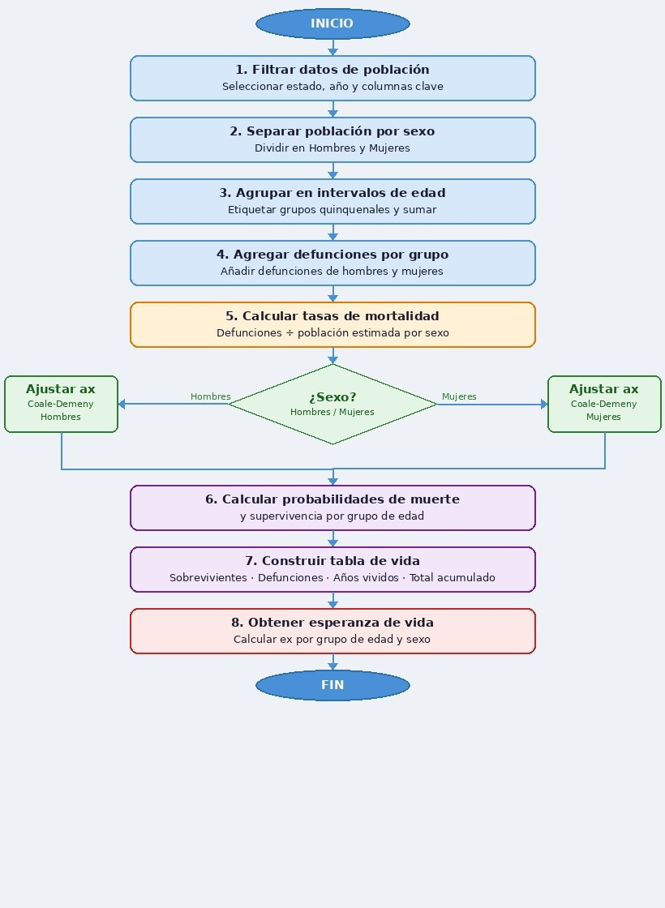

## Introducción

El Estado de México, México o por su acrónimo Edomex, es uno de los 32 estados que conforman a los Estados Unidos Mexicanos. Con una extensión de 22 357 $km^2$ divididos en 125 municipios y aun siendo la séptima entidad menos extensa, cuenta con la población más grande de todo el país; condición que se ha mantenido a lo largo de los años. Debido a su cercania con la capital, el Estado de México recibe uno de los mayores flujos migratorios del país; ya sea por personas que buscan acercarse a la CDMX con el fin de encontrar mejores oportunidades o por el contrario, personas que habitaban en la CDMX y cambiaron su residencia permanente al Estado de México.
En este documento haremos un análisis sobre el impacto de la pandemía de COVID-19 a traves de las tablas de vida de los años 2010, 2019 y 2021. Haremos hincapié en los puntos antes mencionados y además veremos como fue afectada la esperanza de vida para tener un contexto de lo que sucedío realmente. Los datos poblacionales son recopilados de la CONAPO y los datos sobre defunciones del INEGI. 

```{r,echo = FALSE, message=FALSE, warning=FALSE}
##Lectura del primer objeto de la web
# 1. Remover los objetos
rm(list = ls())

# 2. Instalar paquetes y cargar paquetes
#install.packages("data.table", dependencies = T)
#install.packages("ggplot2")
#install.packages("dplyr")
#install.packages("tidyr")
#install.packages("kableExtra", dependencies = T)
#install.packages("lubridate", dependencies = T)
#install.packages("knitr", dependencies = T)
library(data.table)
library(ggplot2)
library(dplyr)
library(tidyr)
library(kableExtra)
library(lubridate)
library(knitr)

# 3. Cargamos la tabla de datos con las poblaciones
#pop <- fread("https://repodatos.atdt.gob.mx/CONAPO/proyecciones/00_Pob_Mitad_1950_2070.csv")
pop <-fread("data/00_Pob_Mitad_1950_2070.csv")
```


Comenzaremos haciendo una breve revisión de las pirámides poblacionales, comparando las proyecciones poblacionales del año en curso 2026 y las proyecciones correspondientes al 2070 para así tener un contexto inicial de como se comporta la población de nuestro territorio de estudio.

```{r, echo=FALSE, fig.height=2.5, fig.width=4}
#Guardamos los datos necesarios en una variable
edomx <- pop[pop$ENTIDAD == "México" & ANIO == "2026", .(SEXO, EDAD, POBLACION)]
#Reorganizamos los datos
edomxp <- edomx %>%
  mutate(POBLACION = ifelse(SEXO == "Hombres", -POBLACION, POBLACION))
#Creamos la pirámide
ggplot(edomxp, aes(x = EDAD, y = POBLACION, fill = SEXO)) +
  geom_bar(stat = "identity", position = "identity") +
  coord_flip() +
  scale_y_continuous(
    labels = abs,  
    breaks = seq(-150000, 150000, 100000),
    name = "Población"
  ) +
  scale_fill_manual(values = c("Hombres" = "steelblue", "Mujeres" = "pink")) +
  labs(
    title = "Pirámide Poblacional
    Estado de México (2026)",
    x = "Edades",
    fill = "Sexo",
    caption = "CONAPO"
  ) +
  theme_minimal() +
  theme(
    legend.position = "bottom",
    plot.title = element_text(hjust = 0.5, size = 5, face = "bold"),
    axis.text.x = element_text(angle = 0, hjust = 0.5)
  )
```

En esta primer pirámide podemos ver como el grueso de la población se encuentra entre los 15 y 30 años, con una leve superioridad de la población de hombres en ese rango y que se mantiene en edades menores. De forma opuesta, en todas las edades superiores a los 30 años la población de mujeres es superior. Finalmente cabe recalcar que se puede ver una clara disminución del aumento de las poblaciones menores a 15 años, por lo que nuestra pirámide empieza a tender a una forma rectangular.

```{r, echo=FALSE, fig.height=2.5, fig.width=4}
#Guardamos los datos necesarios en una variable
edomx <- pop[pop$ENTIDAD == "México" & ANIO == "2070", .(SEXO, EDAD, POBLACION)]
#Reorganizamos los datos
edomxp <- edomx %>%
  mutate(POBLACION = ifelse(SEXO == "Hombres", -POBLACION, POBLACION))
#Creamos la pirámide
ggplot(edomxp, aes(x = EDAD, y = POBLACION, fill = SEXO)) +
  geom_bar(stat = "identity", position = "identity") +
  coord_flip() +
  scale_y_continuous(
    labels = abs,  
    breaks = seq(-120000, 120000, 80000),
    name = "Población"
  ) +
  scale_fill_manual(values = c("Hombres" = "steelblue", "Mujeres" = "pink")) +
  labs(
    title = "Pirámide Poblacional
    Estado de México (2070)",
    x = "Edades",
    fill = "Sexo",
    caption = "CONAPO"
  ) +
  theme_minimal() +
  theme(
    legend.position = "bottom",
    plot.title = element_text(hjust = 0.5, size = 7, face = "bold"),
    axis.text.x = element_text(angle = 0, hjust = 0.5)
  )
```

En esta segunda pirámide podemos ver como el grueso de la población se encuentra entre los 45 y 75 años (que es el mismo observado en la pirámide anterior), con una superioridad de la población de mujeres, misma que es perceptible a partir del rango de 30 años y crece para edades superiores. De forma opuesta, en todas las edades inferiores a los 30 años la población de mujeres es inferior. Finalmente aqui ya es completamente visible la población joven ha empezado a disminuir, por lo que nuestra pirámide se rectangularizó.

En conjunto podemos ver un par de cosas; la población en general disminuyo pasando de tener las edades con poblaciones mayores al rededor de los 150,000 habitantes para 44 años después rondar los 120,000 habitantes. Por otro lado podemos ver que al pasar los años la población de hombres baja significativamente en comparación a la de mujeres, a pesar de que en edades jóvenes la población de hombres es mayor.

## Metodología a seguir
Para la creación de las tablas de vida usaremos como base el siguiente diagrama de flujo en el que se muestra el proceso necesario de tratado de los datos  




## Expresiones matemáticas
Durante el desarrollo de este documento se usaron las siguientes formulas para el desarrollo del mismo:
Asumiremos que las tasas especificas por edad son iguales a las tasas por periodo:
$$_nm_x = _nM_x = \frac{_nD_x}{_nK_x}$$
Para edades de 0 a 1 usaremos la relación de Coule y Demeny correspondiente:
$$
a_0 = 
\begin{cases}
0,330 & \text{Hombres, } m_0 \geq 0,107 \\
0,350 & \text{Mujeres, } m_0 \geq 0,107 \\
0,045 + 2,684 \, m_0 & \text{Hombres, } m_0 < 0,107 \\
0,053 + 2,800 \, m_0 & \text{Mujeres, } m_0 < 0,107
\end{cases}
$$
Para edades de 1 a 4 usaremos la relación de Coule y Demeny correspondiente:
$$
_4a_1 = 
\begin{cases}
1,352 & \text{Hombres, } m_0 \geq 0,107 \\
1,361 & \text{Mujeres, } m_0 \geq 0,107 \\
1,651 - 2,816 \, m_0 & \text{Hombres, } m_0 < 0,107 \\
1,522 - 1,518 \, m_0 & \text{Mujeres, } m_0 < 0,107
\end{cases}
$$
En cualquier otro caso:
$$ _na_x = \frac{n}{2}$$
Las probabilidades de muerte estan dadas por:

$$_nq_x = \frac{n \cdot _nm_x}{1+(n-_na_x)\cdot_nm_x}$$
Las probabilidades de supervivencia estan dadas por:
$$_np_x = 1- _nq_x$$

Los supervivientes a edad x estan dados por:
$$l_{x+n} = l_x \cdot _nq_x$$
Las defunciones estan dadas por:
$$_nd_x = l_x-l_{x+n}$$
Los Años-Persona-Vividos estan dados por:
$$_nL_x = (n\cdot l_{x+n})+(_na_x \cdot _nd_x)$$

Los Años-Persona-Vividos en $85+$ estan dadps por
$$_{85+}L_x = \frac{l_x}{_{85+}m_x}$$
El total de Años-Persona-Vividos esta dado por:
$$T_x = \Sigma _{i = x}^{85+}$$

La esperanza de vida a edad x esta dada por:
$$e_x = \frac{T_x}{l_x}$$
Finalmente la tasa de crecimiento exponencial esta dada por:
$$ K(t) = e^{Rt} K(0) = \exp(Rt) K(0) $$


## Escritura de funciones
A continuación mostramos los códigos correspondientes a las expresiones anteriores, mismos que se usaron para calcular cada uno de los datos necesarios para la creación de las tablas de vida y de la tasa de crecimiento exponencial.

```{r}
###Formato
#Creamos una función para darle forma a nuestros datos provenientes de CONAPO
#Obtenemos los datos de nuestro estado en el año a calcular la tabla de vida
forma <- function (Y,Z) {
  edomx <-pop[pop$ENTIDAD == "México" & ANIO == Y, .( SEXO, EDAD, POBLACION)]
#Separamos las poblaciones por sexos
edomx1 <- edomx %>%
  filter(SEXO ==  "Hombres")
edomx2 <- edomx %>%
  filter(SEXO ==  "Mujeres")

#Remplazamos las poblaciones ya separadas por sexos
edomx <- edomx1 %>%
  mutate(EDAD = EDAD, MALE = POBLACION, FEMALE = edomx2$POBLACION, 
         .keep = "none")

#Etiquetamos en grupos de edades quinquenales a las poblaciones
edomx$AGE<- cut(edomx$EDAD, 
                           breaks = c(0, 1, 5, 10, 15, 20, 25, 30, 35, 40, 45, 50,
                                      55, 60, 65, 70, 75, 80, 85, 110),
                           right = FALSE,
                           labels = c("0", "1", "5", "10", "15", "20", "25", 
                           "30", "35", "40", "45", "50", "55", "60", "65", "70", 
                           "75", "80", "85+"),
                           include.lowest = TRUE)
#Sumamos las poblaciones de cada grupo.
edomx <- edomx %>%
  group_by(AGE) %>%
  summarize(
    K_MALE = sum(MALE),
    K_FEMALE = sum(FEMALE)
  ) 
#Agregamos la temporalidad que estamos usando
edomx$n <- c(1,4,5,5,5,5,5,5,5,5,5,5,5,5,5,5,5,5,5)
edomx <- edomx %>%
  relocate(n, .before = AGE)
#Finalmente agregamos las defunciones de cada grupo.
edomx <- edomx %>%
  mutate(D_MALE = Z$M, D_FEMALE = Z$F)
return(edomx)
}


```

```{r}
###Crecimiento exponencial
#Creamos la función para calcular nuestro crecimiento exponencial
expo <- function(K_0, K_T, t_0, t_T, t){
dt <- decimal_date(as.Date(t_T)) - decimal_date(as.Date(t_0))
  r <- log(K_T/K_0)/dt
  h <- t - decimal_date(as.Date(t_0))
  K_h <- K_0 * exp(r*h)  
  return(K_h)
}

```

```{r}
###Calculo de tasas de mortalidad
#Creamos una función para calcular las tasas de mortalidad por periodo con los
#datos que tenemos y lo añadimos a nuestro data set.
mx <- function(ds){
  ds$Mm <- ds$D_MALE/ds$K_MALE
  ds$Mf <- ds$D_FEMALE/ds$K_FEMALE
  
  return(ds)
}
```

```{r}
##Tabla de mortalidad
#Creamos la función de nuestra tabla de mortalidad
#i representa un indicador tal que 0 representa hombres y 1 mujeres
lt <- function(ds, i){
  #Creamos una tabla para almacenar los datos
  lt <- data.table()
  
  #Tomamos el tamaño de nuestros datos
  m <- length(ds$AGE)
  #Definimos ax
  ax <- ds$n/2
  
  #Aplicamos Coale y Demeny para edades 0-1
  if(i == 0){
    ax[1] <- ifelse(ds$Mm >= 0.107, 0.330, 0.045+2.684*ds$Mm)
  }else if(i == 1){
    ax[1] <- ifelse(ds$Mf >= 0.107, 0.350, 0.053+2.800*ds$Mf)
  }
  #Aplicamos Coale y Demeny para edades 1-4
  if(i == 0){
    ax[2] <- ifelse(ds$Mm >= 0.107, 1.352, 1.651+2.816*ds$Mm)
  }else if(i == 1){
    ax[2] <- ifelse(ds$Mf >= 0.107, 1.361, 1.522+1.518*ds$Mf)
  }
  
  #Calculamos las probabilidades de muerte
  if(i == 0){
    qx <- (ds$n*ds$Mm)/(1+(ds$n-ax)*ds$Mm)
    qx[m] <- 1
  }else if(i == 1){
    qx <- (ds$n*ds$Mf)/(1+(ds$n-ax)*ds$Mf)
    qx[m] <- 1
  }
  
  #Calculamos la probabilidad de supervivencia
  px <- 1-qx
  
  #Calculamos las poblaciones con un radix inicial de 100000
  lx <- 100000*cumprod(c(1,px[-m]))
  
  #Calculamos las defunciones
  dx <- c(-diff(lx), lx[m])
  
  #Calculamos los años persona vividos
  Lx <- ds$n*c(lx[-1],0) + ax*dx
  if(i == 0){
    Lx[m] <- lx[m]/ds$Mm[m]
  }else if(i == 1){
    Lx[m] <- lx[m]/ds$Mf[m]
  }
  
  #Calculamos el total de años presona vividos
  Tx <- rev(cumsum(rev(Lx)))
  
  #Calculamos la esperanza de vida 
  ex <- Tx/lx
  
  lt$x <- ds$AGE
  lt$n <- ds$n
  
  if(i == 0){
    lt$mx <- ds$Mm
  }else if(i == 1){
    lt$mx <- ds$Mf
  }
  lt$ax <- ax
  lt$qx <- qx
  lt$px <- px
  lt$lx <- lx
  lt$dx <- dx
  lt$Lx <- Lx
  lt$Tx <- Tx
  lt$ex <- ex
  return(lt)
}

```
\newpage

## Tablas de vida
Una vez planteado lo anterior podemos proceder con el calculo de las tablas de vida correspondientes al 2010, 2019 y 2021. Las presentamos a continuación

```{r, echo = FALSE, message=FALSE, warning=FALSE}
deaths <-fread("data/Defunciones2010.csv")
edomx <- forma("2010", deaths)
edomx10 <- mx(edomx)


edomx10m <- lt(edomx10, 0)
kable(edomx10m, 
      caption = "Tabla de vida para hombres 2010",
      booktabs = TRUE) %>%
  kable_styling(latex_options = "scale_down",
                font_size = 7) %>%
  column_spec(1, width = "2cm")

edomx10f <- lt(edomx10, 1)
kable(edomx10f, 
      caption = "Tabla de vida para mujeres 2010",
      booktabs = TRUE) %>%
  kable_styling(latex_options = "scale_down",
                font_size = 7) %>%
  column_spec(1, width = "2cm")

```
\newpage

```{r, echo = FALSE, message=FALSE, warning=FALSE}
deaths <-fread("data/Defunciones2019.csv")
edomx <- forma("2019", deaths)
edomx19 <- mx(edomx)
edomx19m <- lt(edomx19, 0)
kable(edomx10f, 
      caption = "Tabla de vida para hombres 2019",
      booktabs = TRUE) %>%
  kable_styling(latex_options = "scale_down",
                font_size = 7) %>%
  column_spec(1, width = "2cm")
  

edomx19f <- lt(edomx19, 1)
kable(edomx19f, 
      caption = "Tabla de vida para mujeres 2019",
      booktabs = TRUE) %>%
  kable_styling(latex_options = "scale_down",
                font_size = 7) %>%
  column_spec(1, width = "2cm")
```
\newpage

```{r, echo = FALSE, message=FALSE, warning=FALSE}
deaths <-fread("data/Defunciones2021.csv")
edomx <- forma("2021", deaths)
edomx21 <- mx(edomx)
edomx21m <- lt(edomx21, 0)
kable(edomx21m, 
      caption = "Tabla de vida para hombres 2021",
      booktabs = TRUE) %>%
  kable_styling(latex_options = "scale_down",
                font_size = 7) %>%
  column_spec(1, width = "2cm")
edomx21f <- lt(edomx21, 1)
kable(edomx21f, 
      caption = "Tabla de vida para mujeres 2021",
      booktabs = TRUE) %>%
  kable_styling(latex_options = "scale_down",
                font_size = 7) %>%
  column_spec(1, width = "2cm")
```
\newpage
## Otros resultados
De las tablas anteriores podemos tomar los siguientes datos:
```{r, echo = FALSE, message=FALSE, warning=FALSE}
  esp <- data.table()
  esp$anio <- c("2010", "2019", "2021")
  esp$eM <- c(edomx10m$ex[1], edomx19m$ex[1], edomx21m$ex[1])
  esp$eF <- c(edomx10f$ex[1], edomx19f$ex[1], edomx21f$ex[1])
  kable(esp, 
      caption = "Tabla de esperanza de vida al nacer",
      booktabs = TRUE) 
  
```
Con los que podemos ver como hubo un impacto a la esperanza de vida en ambos generos. 

Por otro lado, en la siguiente gráfica podemos ver el crecimiento poblacional esperado con la tasa de crecimiento que obtenemos de los censos de la decada de 2010 y 2020:
```{r, echo = FALSE, message=FALSE, warning=FALSE}
cre_exp <- expo( K_0=16594825, K_T=17723173, 
                 t_0="2010-06-25", t_T="2020-03-15",     
                 t=seq(2010.5, 2026.5, 0.5))

data.frame(Año = c(decimal_date(as.Date("2010-06-25")), 
                   decimal_date(as.Date("2020-03-15")), seq(2010.5, 2026.5, 0.5)),
           K_t   = c(16594825, 17723173, cre_exp)) %>% 
  ggplot(aes(Año, K_t)) + 
  geom_line() + 
  geom_point()
```
Por otro lado podemos ver las gráficas correspondientes a las tasas de mortalidad de cada tabla:
```{r,  echo=FALSE, fig.height=2.5, fig.width=8}
ggplot(edomx10m, aes( x, mx, group = 1 )) +
  geom_line(color = "green", linewidth  = 1.2, linetype = "solid") +
  labs(title = "Tasas de mortalidad (Hombres, 2010)",
       x = "Edad",
       y = "Tasa de mortalidad (mx)") +
  theme_minimal() + scale_y_log10()
  
ggplot(edomx10f, aes( x, mx, group = 1 )) +
  geom_line(color = "green", linewidth  = 1.2, linetype = "solid") +
  labs(title = "Tasas de mortalidad (Mujeres, 2010)",
       x = "Edad",
       y = "Tasa de mortalidad (mx)") +
  theme_minimal() + scale_y_log10()

ggplot(edomx19m, aes( x, mx, group = 1 )) +
  geom_line(color = "green", linewidth  = 1.2, linetype = "solid") +
  labs(title = "Tasas de mortalidad (Hombres, 2019)",
       x = "Edad",
       y = "Tasa de mortalidad (mx)") +
  theme_minimal() + scale_y_log10()

ggplot(edomx19f, aes( x, mx, group = 1 )) +
  geom_line(color = "green", linewidth  = 1.2, linetype = "solid") +
  labs(title = "Tasas de mortalidad (Mujeres, 2019)",
       x = "Edad",
       y = "Tasa de mortalidad (mx)") +
  theme_minimal() + scale_y_log10()

ggplot(edomx21m, aes( x, mx, group = 1 )) +
  geom_line(color = "green", linewidth  = 1.2, linetype = "solid") +
  labs(title = "Tasas de mortalidad (Hombres, 2021)",
       x = "Edad",
       y = "Tasa de mortalidad (mx)") +
  theme_minimal() + scale_y_log10()

ggplot(edomx21f, aes( x, mx, group = 1 )) +
  geom_line(color = "green", linewidth  = 1.2, linetype = "solid") +
  labs(title = "Tasas de mortalidad (Mujeres, 2021)",
       x = "Edad",
       y = "Tasa de mortalidad (mx)") +
  theme_minimal() + scale_y_log10()

```

Despúes veremos el cambio en la esperanza de vida en cada tabla:
```{r, echo=FALSE, fig.height=2.5, fig.width=8}
ggplot(edomx10m, aes(x, ex, group = 1)) +
  geom_line(color = "blue", linewidth = 1.2, linetype = "solid") +
  labs(title = "Esperanza de vida (Hombres, 2010)",
       x = "Edad",
       y = "Esperanza de vida (ex)") +
  theme_minimal()

ggplot(edomx10f, aes(x, ex, group = 1)) +
  geom_line(color = "blue", linewidth = 1.2, linetype = "solid") +
  labs(title = "Esperanza de vida (Mujeres, 2010)",
       x = "Edad",
       y = "Esperanza de vida (ex)") +
  theme_minimal()

ggplot(edomx19m, aes(x, ex, group = 1)) +
  geom_line(color = "blue", linewidth = 1.2, linetype = "solid") +
  labs(title = "Esperanza de vida (Hombres, 2019)",
       x = "Edad",
       y = "Esperanza de vida (ex)") +
  theme_minimal()

ggplot(edomx19f, aes(x, ex, group = 1)) +
  geom_line(color = "blue", linewidth = 1.2, linetype = "solid") +
  labs(title = "Esperanza de vida (Mujeres, 2019)",
       x = "Edad",
       y = "Esperanza de vida (ex)") +
  theme_minimal()

ggplot(edomx21m, aes(x, ex, group = 1)) +
  geom_line(color = "blue", linewidth = 1.2, linetype = "solid") +
  labs(title = "Esperanza de vida (Hombres, 2021)",
       x = "Edad",
       y = "Esperanza de vida (ex)") +
  theme_minimal()

ggplot(edomx21f, aes(x, ex, group = 1)) +
  geom_line(color = "blue", linewidth = 1.2, linetype = "solid") +
  labs(title = "Esperanza de vida (Mujeres, 2021)",
       x = "Edad",
       y = "Esperanza de vida (ex)") +
  theme_minimal()

```

Finalmente añadiremos la gráfica de las defunciones de cada tabla

```{r, echo=FALSE, fig.height=2.5, fig.width=8}
ggplot(edomx10m, aes(x, dx, group = 1)) +
  geom_line(color = "red", linewidth = 1.2, linetype = "solid") +
  labs(title = "Defunciones (Hombres, 2010)",
       x = "Edad",
       y = "Defunciones (dx)") +
  theme_minimal()

ggplot(edomx10f, aes(x, dx, group = 1)) +
  geom_line(color = "red", linewidth = 1.2, linetype = "solid") +
  labs(title = "Defunciones (Mujeres, 2010)",
       x = "Edad",
       y = "Defunciones (dx)") +
  theme_minimal()

ggplot(edomx19m, aes(x, dx, group = 1)) +
  geom_line(color = "red", linewidth = 1.2, linetype = "solid") +
  labs(title = "Defunciones (Hombres, 2019)",
       x = "Edad",
       y = "Defunciones (dx)") +
  theme_minimal()

ggplot(edomx19f, aes(x, dx, group = 1)) +
  geom_line(color = "red", linewidth = 1.2, linetype = "solid") +
  labs(title = "Defunciones (Mujeres, 2019)",
       x = "Edad",
       y = "Defunciones (dx)") +
  theme_minimal()

ggplot(edomx21m, aes(x, dx, group = 1)) +
  geom_line(color = "red", linewidth = 1.2, linetype = "solid") +
  labs(title = "Defunciones (Hombres, 2021)",
       x = "Edad",
       y = "Defunciones (dx)") +
  theme_minimal()

ggplot(edomx21f, aes(x, dx, group = 1)) +
  geom_line(color = "red", linewidth = 1.2, linetype = "solid") +
  labs(title = "Defunciones (Mujeres, 2021)",
       x = "Edad",
       y = "Defunciones (dx)") +
  theme_minimal()

```


## Análisis final
A pesar de parecer que tenemos un sesgo en los datos de defunciones de todos los años; que se podria tratar de evitar tomando un enfoque de uso de datos únicamente provenientes de CONAPO. Los resultados permiten extraer tres conclusiones centrales:
\begin{itemize}
\item La reducción de mortalidad infantil y el avance de la esperanza de vida entre 2010 y 2019 son evidentes, aunque la clara supremacia de la mortalidad masculina en edades jóvenes no permitio un avance mayor.
\item La caída de casi 8 años en la esperanza de vida masculina en un solo año no tiene comparación en la serie analizada. Las características del Edomex mencionadas; densidad extrema, dependencia económica de la CDMX, alta concentración de trabajadores esenciales en zonas conurbadas; probablemente amplificaron el impacto por encima de lo observado en entidades menos urbanizadas.
\item La mayor letalidad del COVID-19 en hombres, combinada con su mayor exposición laboral y una sabida menor tendencia de asistir a consultas médicas preventivas, produjo la brecha histórica de 7.67 años en 2021, subrayando la necesidad de incorporar perspectivas diferenciadas por sexo en la planificación de emergencias sanitarias futuras.
\end{itemize}
